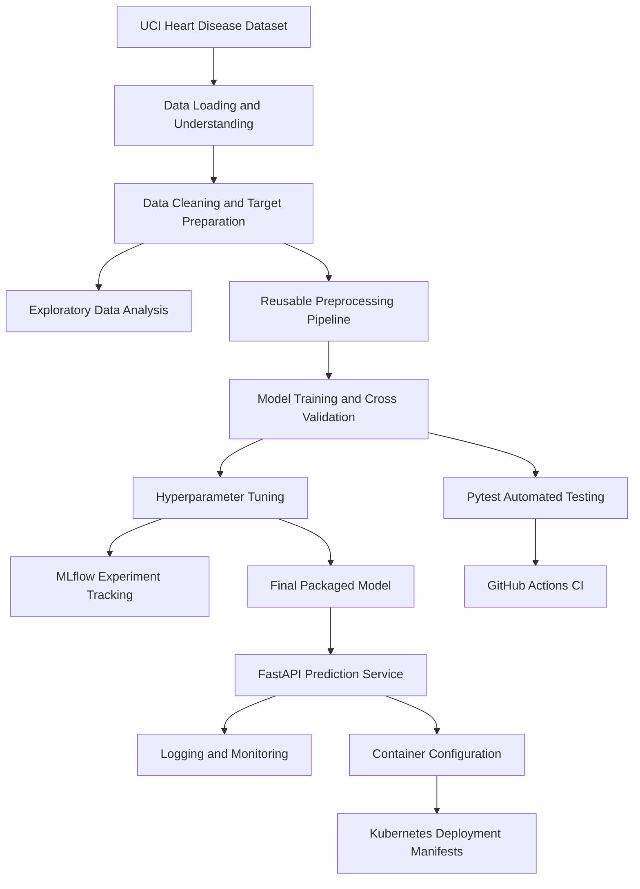

# Heart Disease MLOps Assignment Report

| **Student Details** | |
|---|---|
| **Name** | RIYAZ AHAMED. M |
| **Student ID** | 2024AC05094 |
| **Subject** | MLOps |
| **Title** | Heart Disease Prediction |

---

## 1. Introduction

This project focuses on building an end-to-end MLOps workflow for heart disease prediction using the UCI Heart Disease dataset. The work goes beyond only training a machine learning model. It also covers data preparation, experiment tracking, packaging, testing, API development, CI/CD, monitoring, and deployment preparation.

The main objective was to organize the solution in a way that is reproducible, maintainable, and closer to a real-world machine learning system rather than a notebook-only implementation.

---

## 2. Problem Statement

The aim of this project is to predict whether a patient is likely to have heart disease based on clinical features such as age, cholesterol, resting blood pressure, chest pain type, and other medical indicators.

Along with model accuracy, the assignment also emphasizes operational aspects of machine learning, including:

- data cleaning and preprocessing
- feature engineering
- model comparison and tuning
- experiment tracking
- API serving
- testing and CI/CD
- monitoring and deployment readiness

---

## 3. Dataset Acquisition

The dataset used in this project is the processed Cleveland subset of the UCI Heart Disease dataset.

Files used:

- `data/raw/processed.cleveland.data`
- `data/raw/heart-disease.names`

The dataset contains 303 records. The original target column is `num`, where:

- `num = 0` means no heart disease
- `num = 1, 2, 3, 4` means heart disease is present

To make the workflow reproducible, data loading and initial inspection were implemented as Python scripts inside the `src/data` module.

---

## 4. Data Understanding and Cleaning

The first step was to inspect the dataset and check for basic quality issues such as missing values, duplicates, and incorrect target formatting.

Initial observations:

- dataset shape: 303 rows and 14 columns
- missing values in `ca`: 4
- missing values in `thal`: 2
- duplicate rows: 0

Since the missing values were limited to only two columns, I handled them using mode imputation. This was a simple and suitable choice for the given dataset structure.

The original `num` column was kept for reference, and a new binary target column called `target` was created using the following rule:

- if `num == 0`, then `target = 0`
- if `num > 0`, then `target = 1`

After this step, the processed dataset contained 303 rows and 15 columns.

One important design choice in this project was to keep the cleaning logic in reusable Python scripts instead of relying only on notebook cells. This makes the preprocessing easier to rerun from a clean environment.

---

## 5. Exploratory Data Analysis

Exploratory Data Analysis was carried out to understand the distribution of features, identify potential patterns, and check how the target variable behaves before model training.

The EDA workflow included:

- dataset overview
- missing value summary
- target class distribution
- histograms of numeric features
- correlation heatmap
- boxplots for important numeric columns
- feature versus target plots for selected clinical variables

Generated EDA artifacts:

- `artifacts/eda/class_distribution.png`
- `artifacts/eda/correlation_heatmap.png`
- `artifacts/eda/numeric_histograms.png`
- `artifacts/eda/numeric_boxplots.png`
- `artifacts/eda/feature_vs_target.png`
- `artifacts/eda/eda_findings.md`

### Key Findings

The binary target classes were fairly balanced:

- 164 patients without heart disease
- 139 patients with heart disease

This was useful because it reduced the risk of the model simply favoring one dominant class.

Among the numeric features, `oldpeak` showed one of the strongest relationships with the target, with a correlation of about 0.42. Clinical variables such as `cp`, `exang`, `thal`, and `ca` also showed visible differences between the disease and non-disease groups.

Another practical observation was that variables like cholesterol, resting blood pressure, and `oldpeak` showed wider spread and possible outliers. This supported the later decision to use structured preprocessing instead of feeding raw values directly into the models.

---

## 6. Feature Engineering and Preprocessing

To keep training and prediction consistent, a reusable preprocessing pipeline was built using Scikit-learn components.

The preprocessing workflow includes:

- missing value handling
- feature transformation
- encoding where needed
- scaling for models that benefit from normalized input

This preprocessing step is part of the same pipeline as the classifier. As a result, the final packaged model uses the exact same transformation logic during inference that was used during training.

This improves reproducibility and avoids a common issue where training-time preprocessing and prediction-time preprocessing become different over time.

---

## 7. Model Development and Evaluation

Two classification models were trained and compared:

1. Logistic Regression
2. Random Forest Classifier

The data was split into training and testing sets using a reproducible train-test split. Stratification was applied so that the class distribution remained similar in both sets.

Evaluation was based on:

- accuracy
- precision
- recall
- F1-score
- ROC-AUC

Cross-validation was used during comparison so that the results were not dependent on a single split alone.

### Baseline Results

The best baseline model was Logistic Regression.

Important test metrics:

- test ROC-AUC: 0.966
- test recall: 0.929
- test F1-score: 0.881

Artifacts for model comparison are available under:

- `artifacts/model_training/model_comparison.csv`
- `artifacts/model_training/confusion_matrices.png`
- `artifacts/model_training/roc_curves.png`

From the baseline comparison, Logistic Regression already performed strongly and gave a very competitive ROC-AUC score.

---

## 8. Hyperparameter Tuning

Hyperparameter tuning was performed using grid search for both:

- Logistic Regression
- Random Forest Classifier

ROC-AUC from cross-validation was used as the main selection criterion during tuning.

The final tuned model selected was:

- `logistic_regression_tuned`

Best parameters:

- `classifier__C = 0.1`
- `classifier__solver = liblinear`

Performance of the tuned Logistic Regression model:

- best CV ROC-AUC: 0.899
- test ROC-AUC: 0.966
- test recall: 0.929

Although the tuning step did not drastically change the final test ROC-AUC, it helped confirm that Logistic Regression remained the best overall choice for this dataset.

Artifacts from this step are stored under:

- `artifacts/model_tuning/best_parameters.csv`
- `artifacts/model_tuning/tuned_model_comparison.csv`
- `artifacts/model_tuning/tuned_confusion_matrices.png`
- `artifacts/model_tuning/tuned_roc_curves.png`

---

## 9. Experiment Tracking with MLflow

MLflow was integrated to record model experiments in a structured way.

Experiment name:

- `heart_disease_classification`

Tracked runs:

- `logistic_regression_tracking`
- `random_forest_tracking`

For each run, the project logs:

- model parameters
- cross-validation metrics
- test metrics
- confusion matrix plots
- ROC curves
- trained model artifacts

The tracked results showed:

- Logistic Regression test ROC-AUC: 0.966
- Logistic Regression test recall: 0.929
- Random Forest test ROC-AUC: 0.950
- Random Forest test recall: 0.893

MLflow outputs are stored under:

- `mlruns/`
- `artifacts/experiment_tracking/experiment_results.csv`
- `artifacts/experiment_tracking/experiment_summary.md`

This step was useful because it made it easier to compare runs and justify why one model was selected over another.

---

## 10. Model Packaging and Reproducibility

The final model was packaged using `joblib` so that it could be reused directly for prediction without retraining.

Saved outputs:

- `models/final_heart_disease_model.joblib`
- `models/model_metadata.json`
- `models/sample_input.json`
- `artifacts/model_packaging/prediction_check.json`

The saved model contains both:

- the preprocessing pipeline
- the trained classifier

This was an important part of the project because it ensures that the same exact pipeline can be loaded later in the API or in another environment.

Reproducibility is supported through:

- fixed random states
- saved preprocessing pipeline
- stored final model
- metadata and sample input files
- dependency definition in `requirements.txt`

---

## 11. Automated Testing

Automated tests were written using Pytest.

The tests cover:

- data pipeline behavior
- model packaging
- model loading
- prediction execution

The test suite is located in:

- `tests/`

Tests can be executed with:

```powershell
python -m pytest tests
```

This helps make sure that important parts of the pipeline continue to work even after code changes.

---

## 12. CI/CD with GitHub Actions

GitHub Actions was used to set up a Continuous Integration pipeline.

Workflow file:

- `.github/workflows/ci.yml`

The workflow performs:

- repository checkout
- Python setup
- dependency installation
- linting with Flake8
- Pytest execution
- model training validation

One useful part of this step was that the pipeline actually failed during development when there was an issue related to package imports and model packaging order. After fixing that issue, the workflow passed successfully.

This was good evidence that the CI pipeline behaves correctly in both failure and success cases and provides readable logs when something breaks.

---

## 13. Model Serving API

The final packaged model is served through a FastAPI application.

Available endpoints:

- `GET /`
- `GET /health`
- `GET /metrics`
- `POST /predict`

The `/predict` endpoint accepts patient data in JSON format and returns:

- a predicted class
- a confidence score

Prediction flow:

```text
Patient JSON Input
        ↓
FastAPI Validation
        ↓
Saved Preprocessing Pipeline
        ↓
Trained Model
        ↓
Prediction + Confidence
        ↓
JSON Response
```

Example response:

```json
{
  "prediction": 1,
  "confidence": 0.87
}
```

The API was tested locally through Swagger UI and later deployed publicly on Render.

Relevant artifacts:

- `artifacts/api/sample_request.json`
- `artifacts/api/sample_response.json`
- `artifacts/screenshots/api_predict_request_page.png`
- `artifacts/screenshots/api_predict_execute_section.png`
- `artifacts/screenshots/api_predict_response_success.png`

The output should be treated as a model prediction only and not as a medical diagnosis.

---

## 14. Monitoring and Logging

Basic monitoring and request logging were added to the FastAPI application.

Implemented features:

- API request logging
- total request counting
- health request counting
- prediction request counting
- prediction latency tracking
- metrics exposure through `/metrics`

Monitoring artifacts are stored under:

- `artifacts/monitoring/api_requests.log`
- `artifacts/monitoring/metrics_snapshot.json`
- `artifacts/monitoring/monitoring_summary.md`

This does not represent a full production observability stack, but it is enough to demonstrate the core idea of model-serving monitoring for the assignment.

---

## 15. Containerization and Deployment Preparation

The project includes containerization support through the repository configuration so that the API can be packaged in an isolated runtime environment.

The intended container setup includes:

- `the Python runtime`
- `project dependencies`
- `FastAPI application`
- `saved model artifacts`
- `startup configuration`

During development, full local container execution could not be completed on the office laptop because Docker-based tooling required additional platform components and administrator-level installation support. Because of this setup limitation, the container configuration was prepared in the repository, while the final working deployment was completed through Render using the cloud build process.

This approach still demonstrates the containerization and deployment flow required for the assignment, while keeping the implementation aligned with the available development environment.

---

## 16. Kubernetes Deployment Preparation

Kubernetes deployment files were also prepared for the API service:

- `k8s/heart-disease-deployment.yaml`
- `k8s/heart-disease-service.yaml`
- `k8s/deployment_guide.md`

These files define how the containerized API would be deployed and exposed inside a Kubernetes environment.

Expected flow:

```text
Container Image
      ↓
Kubernetes Deployment
      ↓
Application Pod
      ↓
Kubernetes Service
      ↓
FastAPI API
```

These files are presented as deployment-ready manifests for Kubernetes-based deployment.

---

## 17. System Architecture



This architecture shows how the project moves from raw data to a reusable prediction service with testing and deployment preparation included.

---

## 18. Setup Instructions

Install dependencies:

```powershell
python -m pip install --upgrade pip
pip install -r requirements.txt
```

Run the project workflow:

```powershell
python src\data\data_understanding.py
python src\features\clean_data.py
python src\features\prepare_target.py
python src\features\eda.py
python src\models\train_models.py
python src\models\tune_models.py
python src\models\track_experiments.py
python src\models\package_model.py
python -m pytest tests
```

---

## 19. API Access

The API is available both for local testing and public access.

Local run command:

```powershell
uvicorn src.api.main:app --reload
```

Local endpoints:

- Swagger UI: `http://127.0.0.1:8000/docs`
- Health endpoint: `http://127.0.0.1:8000/health`
- Metrics endpoint: `http://127.0.0.1:8000/metrics`
- Prediction endpoint: `http://127.0.0.1:8000/predict`

Public deployed endpoints:

- Base URL: `https://heart-disease-api-lo3h.onrender.com`
- Swagger UI: `https://heart-disease-api-lo3h.onrender.com/docs`
- Health endpoint: `https://heart-disease-api-lo3h.onrender.com/health`
- Prediction endpoint: `https://heart-disease-api-lo3h.onrender.com/predict`

To test the prediction endpoint:

1. Open Swagger UI.
2. Expand `POST /predict`.
3. Click `Try it out`.
4. Provide a valid JSON input.
5. Click `Execute`.
6. Confirm that the response contains both `prediction` and `confidence`.

This verification was completed for both local and public deployment access.

---

## 20. Repository Structure

```text
heart-disease-mlops-assignment/
│
├── data/
├── src/
│   ├── data/
│   ├── features/
│   ├── models/
│   └── api/
├── tests/
├── models/
├── artifacts/
│   ├── eda/
│   ├── model_training/
│   ├── model_tuning/
│   ├── experiment_tracking/
│   ├── model_packaging/
│   ├── api/
│   ├── monitoring/
│   ├── report/
│   └── screenshots/
├── k8s/
├── .github/
│   └── workflows/
├── requirements.txt
├── Dockerfile
└── README.md
```

The project structure separates data processing, modeling, API code, testing, artifacts, and deployment-related files in a clear way.

---

## 21. Repository Link

GitHub repository:

`https://github.com/2024ac05094-Riyaz-Bits/heart-disease-mlops-assignment`

The repository contains all source code, workflows, tests, artifacts, and configuration files used in this assignment.

---

## 22. Limitations

Some parts of the project were completed as deployment-ready configuration rather than as full multi-environment execution. In particular, Kubernetes manifests were prepared and documented, but Kubernetes-based live deployment was not used for the final hosting step.

Even with this limitation, the main MLOps objectives of the assignment were completed:

- the FastAPI application was tested locally
- the `/predict` endpoint was verified successfully
- MLflow tracking was completed
- CI/CD was implemented and verified
- monitoring and logging were implemented
- container and Kubernetes files were prepared
- public deployment was completed successfully on Render

---

## 23. Conclusion

This project demonstrates a complete MLOps workflow for heart disease prediction using the UCI Heart Disease dataset.

The work includes:

- data loading and cleaning
- exploratory analysis
- preprocessing
- model training and tuning
- MLflow tracking
- model packaging
- testing and CI/CD
- FastAPI-based inference
- basic monitoring
- deployment preparation

Among the models tested, tuned Logistic Regression was selected as the final model. It achieved:

- test ROC-AUC: 0.966
- test recall: 0.929

Overall, the project shows how a machine learning model can be developed in a more reproducible and maintainable way, with clear separation between data processing, model logic, API serving, testing, and deployment preparation.


## Final video link:
`https://drive.google.com/drive/folders/13JVcgmtEHPi5-exeUhdflv6UjuE5xdGl?usp=sharing`


## Deployment link:

Swagger UI: `https://heart-disease-api-lo3h.onrender.com/docs`
Health endpoint: `https://heart-disease-api-lo3h.onrender.com/health`
Prediction endpoint: `https://heart-disease-api-lo3h.onrender.com/predict`

